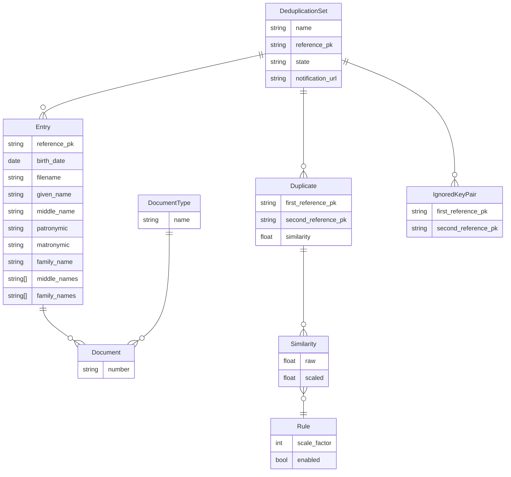

## DB Schema

### Notes

**Entry**

Possible name parts are taken from [Wikipedia](https://en.wikipedia.org/wiki/Personal_name#Structure_in_humans). `middle_name` and `middle_names` are merged into a single list before comparison as well as `family_name` and `family_names`.

**DocumentType**

New document types can be added through admin. It only makes sense to compare documents of the same type.

**Rule**

Rule executes code to compare specific entries. The result of excution is multipled by scale factor. Both raw and scaled result is stored in `Similarity` table.

**Similarity**

`raw` field contains value between 0 and 1. `scaled` field contains value between 0 and 1 calculated using the formula below

```math
\left. {r (x) s} \middle/ {\sum_{i=1}^n s_i} \right.
```

where

- $r (x)$ - rule execution result
- $s$ - specific rule scale factor
- $s_i$ - *ith* enabled rule scale factor

**Duplicate**

`similarity` takes values between 0 and 1. And is computed using formula below

```math
\left. {\sum_{i=1}^n r_i (x) s_i} \middle/ {\sum_{i=1}^n s_i} \right.
```

where
- $r_i (x)$ - *ith* enabled rule execution result
- $s_i$ - *ith* enabled rule scale factor
