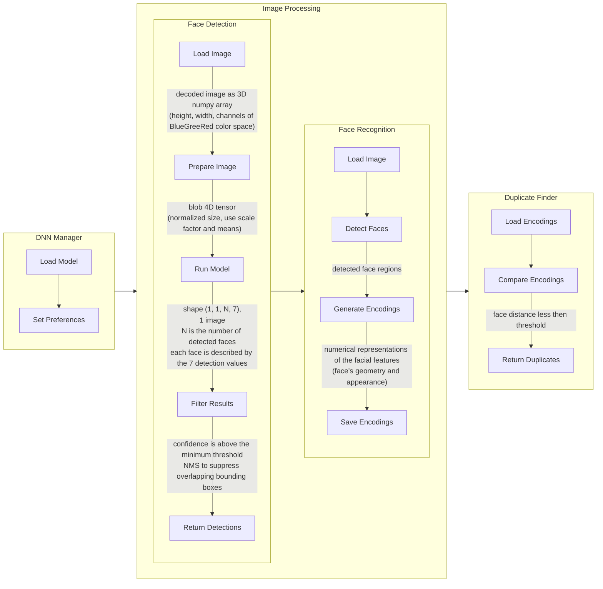

# Deduplication Worlflow
{: .no_toc }

  

    Table of contents
  

  {: .text-delta }
- TOC
{:toc}

---

### Inference Mode Operation

This application operates in inference mode, meaning it utilizes a pre-trained model for face recognition rather than training the model itself. The pre-trained model is stored in Azure Blob Storage and is downloaded by the application upon startup. Additionally, the model can be manually updated via the admin panel.

### Model Details

The face recognition functionality is powered by the [OpenCV](https://github.com/opencv/opencv) library.

Currently, the application uses an open-source model. The model consists of two files: **deploy.prototxt** and **res10_300x300_ssd_iter_140000.caffemodel**. The model was trained using the Caffe deep learning framework and employs the Res10 architecture with a resolution of 300x300 and 140,000 iterations. This model is based on the SSD (Single Shot MultiBox Detector) methodology and is optimized for face detection tasks.

### Worklow Diagram

