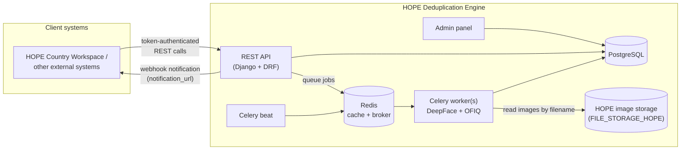

# Architecture

The HOPE Deduplication Engine is a Django application with a REST API, an admin panel, and asynchronous Celery workers.

## Components

- **REST API** — the only interface for client systems. Endpoints cover deduplication sets, image registration, processing, findings, group configuration, and group status. Interactive documentation is served by the application itself at `/api/rest/swagger/` and `/api/rest/redoc/`.
- **Admin panel** (`/admin/`) — used by administrators to manage external systems, API tokens, global default settings ([Constance](https://django-constance.readthedocs.io/)), per-group settings, and to inspect or re-queue processing jobs.
- **PostgreSQL** — stores all metadata: groups, deduplication sets, encodings (including face embeddings as float arrays), findings, and job records.
- **Redis** — Django cache and Celery broker.
- **Celery worker(s)** — run the face pipeline: image quality assessment (OFIQ), face detection and encoding (DeepFace), and duplicate search over the embeddings. This is CPU-heavy; concurrency and thread pools are tuned via environment variables (`OMP_NUM_THREADS`, `TF_NUM_INTRA_OP_THREADS`, `TF_NUM_INTER_OP_THREADS`).
- **Celery beat** — schedules periodic tasks.
- **HOPE image storage** — configured via `FILE_STORAGE_HOPE`, the shared, read-only object store (e.g. Azure Blob Storage) holding the HOPE dataset images. The engine never writes to it; it only reads image bytes by the `filename` (path/key) registered on each `Encoding`.

## Key design points

- **Images are referenced by filename, not uploaded.** The API accepts a `filename` field that is a path/key into the shared HOPE storage. The engine stores that string as-is and reads the image bytes from `FILE_STORAGE_HOPE` when processing.
- **Everything asynchronous happens through jobs.** The `process` endpoint creates a `MainJob` and queues a Celery task. Clients follow progress via the set's `state` (polling) or via webhook notifications.
- **Multi-tenancy through Systems.** Every API token belongs to a user linked to an external *System*. All data is partitioned by system: a client can only see groups and sets belonging to its own system.
- **One active set per group.** A group (e.g. a HOPE program) can have only one deduplication set "in flight" at a time; previously approved sets stay in the group and are used as reference data for future runs. See [Lifecycle](lifecycle.md).
