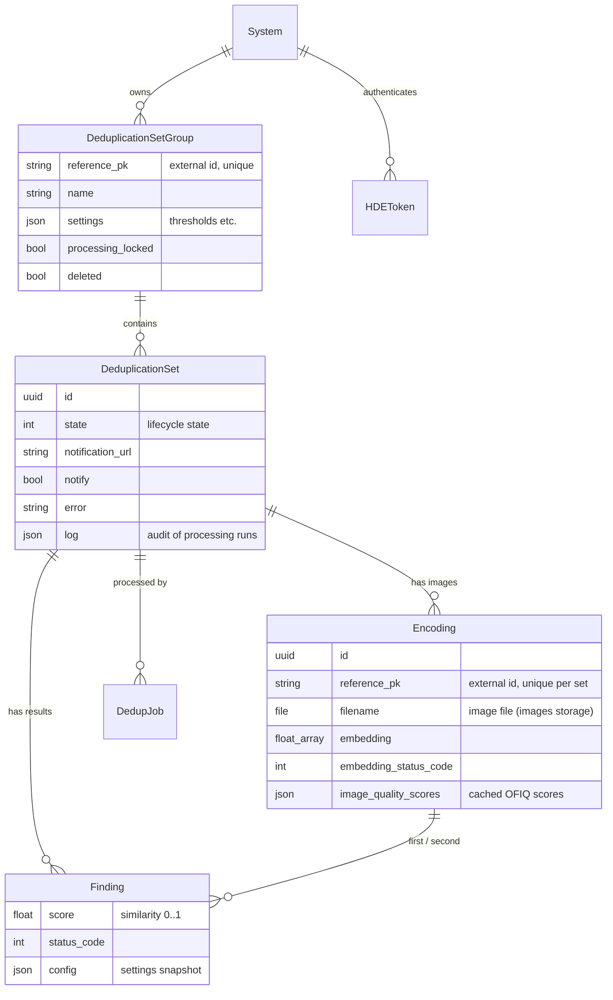

# Data Model

The core of the engine is four models in the `api` app, partitioned per external *System* (the multi-tenancy unit from the `security` app).

## DeduplicationSetGroup

Groups deduplication sets that belong to the same external entity — typically a HOPE program. Clients never create groups explicitly: a group is created automatically the first time a deduplication set (or group configuration) is created with a new `reference_pk`.

- `reference_pk` — the external identifier chosen by the client. All API group endpoints address the group by this value.
- `settings` — the group's deduplication settings (quality and confidence thresholds) as JSON. Snapshotted from the global [Constance defaults](../admin/settings.md) at group creation and modifiable through the [config endpoint](../integration/configuration.md).
- `processing_locked` — guards against concurrent processing jobs in the group.

## DeduplicationSet

One deduplication run over a batch of images. Holds the [lifecycle state](lifecycle.md), an optional `notification_url` for webhook callbacks, the last `error` (for failed states), and an append-only `log` of processing runs (timestamp, action, config snapshot, counts, errors) useful for auditing.

Only one set per group can be *active* (not approved/rejected/failed) at a time — enforced by a database constraint.

## Encoding

One registered image within a set. Despite the name, it starts as just a pair of identifiers:

- `reference_pk` — the client's identifier for the individual/record (unique within the set; re-registering the same `reference_pk` updates the filename instead of duplicating).
- `filename` — a `FileField` backed by the `images` Django storage. The image is stored at a deterministic path (`images/{group_reference_pk}/{set_id}/{filename}`) and read from there at processing time.

During processing the worker fills in:

- `embedding` — the face embedding vector (e.g. 512 floats for Facenet512), or empty if the image could not be encoded.
- `embedding_status_code` — why encoding failed, if it did (see [image status codes](../integration/findings-and-statuses.md#image-status-codes)).
- `image_quality_scores` — cached OFIQ quality scores (0–1 per metric), so re-runs with different thresholds don't recompute them.

## Finding

The results. There are two kinds of rows:

1. **Duplicate pairs** — `first_encoding` + `second_encoding` with a similarity `score` (0–1) and status code 200. Produced by the deduplication step for every pair whose match confidence exceeds the group's `duplicate_confidence_threshold`.
2. **Per-image errors** — `second_encoding` is empty, `score` is 0, and `status_code` explains the problem (no face detected, bad quality, file not found, …). Produced by the encoding step so clients can report unusable images.

Each finding stores a `config` snapshot of the settings that were active when it was produced.

## Supporting models

- **System** (`security` app) — an external client system (e.g. "HOPE"). Everything a token can see is scoped to its system.
- **User / UserRole** — an API user is linked to a System through a UserRole; the API requires the `api.can_use_api` permission.
- **HDEToken** — DRF-style token bound to a user *and* a system; sent as `Authorization: Token <key>`.
- **DedupJob / MainJob** (`jobs`) — Celery-backed job records ([django-celery-boost](https://pypi.org/project/django-celery-boost/)) linking a set to its processing task; visible and re-queueable in the admin panel. `MainJob.encode_only` records whether the run stopped after encoding.
