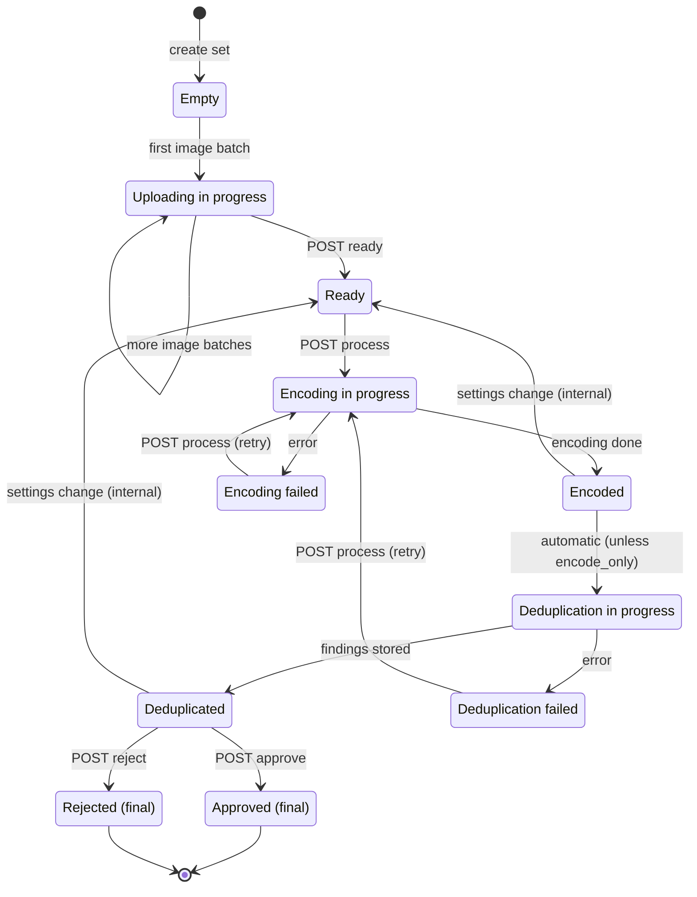

# Deduplication Set Lifecycle

Every deduplication set moves through a well-defined state machine. The current state is returned by the API as a human-readable label (e.g. `"Ready"`, `"Deduplicated"`) and determines which operations are allowed. Invalid operations are rejected with **HTTP 409 Conflict**.

## State diagram

!!! info "About the transitions"
    - **`POST process`** always moves the set to `Encoding in progress`, regardless of the starting state (`Ready`, `Encoded`, `Encoding failed`, or `Deduplication failed`).
    - **`Encoded → Deduplication in progress`** happens automatically within the same processing job (unless `encode_only=true` was requested).
    - **`settings change (internal)`** — when group settings are changed, an `Encoded` or `Deduplicated` set is moved back to `Ready` (embeddings and findings are cleared). This is not triggered by the client directly.

## States

| State | Meaning | What the client can do |
|-------|---------|------------------------|
| `Empty` | Set created, no images yet. | Register image batches. |
| `Uploading in progress` | At least one image batch registered. | Register more batches; call `ready` when done. |
| `Ready` | All images registered; set can be processed. | Call `process`. |
| `Encoding in progress` | Worker is quality-checking and encoding faces. | Wait (poll or receive webhook). |
| `Encoded` | All images encoded into embeddings. Final state when `process` was called with `encode_only=true`. | Call `process` to run deduplication (or re-encode). |
| `Encoding failed` | Unexpected error during encoding; details in the set's `error` field and in Sentry. | Retry `process`. |
| `Deduplication in progress` | Worker is comparing embeddings. | Wait. |
| `Deduplicated` | Findings are available. | Read `findings`; then `approve` or `reject`. |
| `Deduplication failed` | Unexpected error during comparison. | Retry `process`. |
| `Approved` | **Final.** Findings accepted. The set's embeddings become reference data for future sets in the same group. Approved sets disappear from the API list. | Create a new set in the group. |
| `Rejected` | **Final.** Findings discarded. | Create a new set in the group. |

!!! note "Per-image failures do not fail the set"
    Images with no detectable face, multiple faces, or insufficient quality do not put the set into a failed state. They are recorded as findings with a non-success [status code](../integration/findings-and-statuses.md#image-status-codes) so the client can report them. The failed states are reserved for unexpected system errors.

## Groups: one active set at a time

Deduplication sets belong to a **group**, identified by the client-supplied `reference_pk` (for example a HOPE program ID). Groups enforce two rules:

1. **Single active set.** A group can only contain one set that is not in a final or failed state. Attempting to create a second one returns HTTP 409. Use the [group status endpoint](../integration/workflow.md#0-optional-check-the-group-status) to check `can_create` before starting.
2. **Processing lock.** Only one processing job can run per group at a time. `process` returns HTTP 409 while another job is running, and group settings cannot be changed during processing.

**Approved sets are cumulative reference data.** When a new set in the group is deduplicated, its images are compared not only against each other but also against the encodings of all previously *approved* sets in the group. This is how a new intake batch is checked against the already-accepted population.

## Effects of changing settings

Group settings (quality and confidence thresholds — see [Configuration](../integration/configuration.md)) can only be changed while no job is running and no approved set exists in the group. When settings change and the group has a set in `Encoded` or `Deduplicated` state, that set's embeddings and findings are **cleared** and the set is moved back to `Ready`, so the next `process` call re-runs the pipeline with the new settings.
