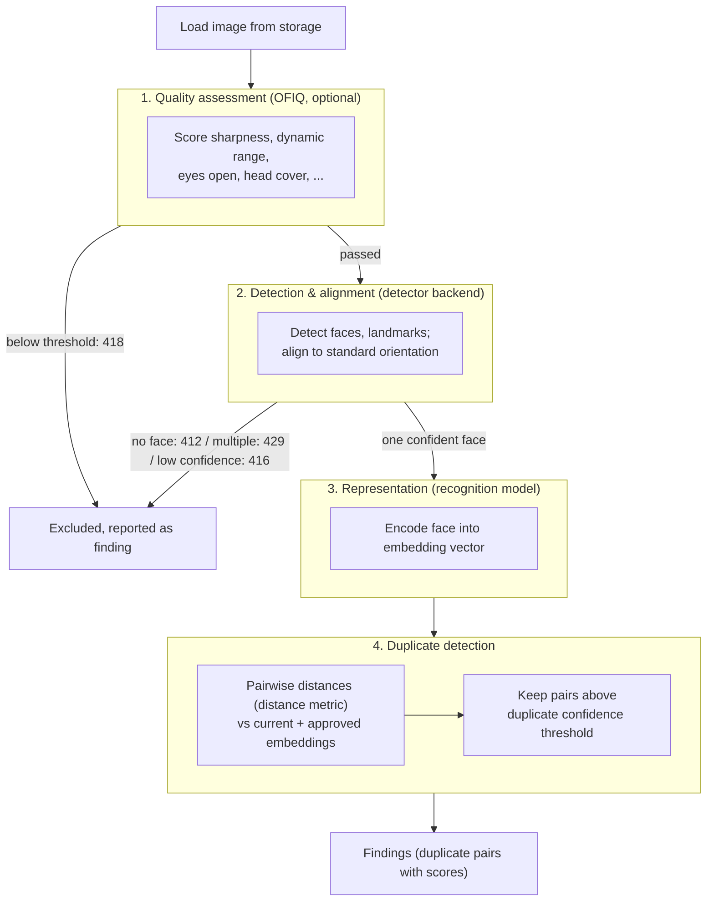

# Face Recognition Pipeline

When a deduplication set is processed, every image goes through a pipeline that turns raw photographs into face *embeddings* (numeric vectors), which are then compared against each other to find duplicates. The pipeline is built on two libraries:

- [OFIQ](https://github.com/BSI-OFIQ/OFIQ-Project) (Open Source Face Image Quality) — standardized face image quality assessment.
- [DeepFace](https://github.com/serengil/deepface) — face detection, alignment, and recognition with multiple interchangeable models and detector backends.

All models and thresholds mentioned here are configurable — globally via the [admin panel](../admin/settings.md), per group via the [config API](../integration/configuration.md). Defaults: **Facenet512** recognition model, **RetinaFace** detector, **cosine** distance metric.

## Stage 1 — Image quality assessment (OFIQ)

*Runs only when at least one quality threshold is enabled (> 0). All quality thresholds default to 0 (disabled).*

The image is scored by OFIQ on a set of standardized metrics, each normalized to 0–1:

| Metric | Config parameter | Measures |
|--------|-----------------|----------|
| Sharpness | `sharpness_threshold` | Focus / motion blur |
| Dynamic range | `dynamic_range_threshold` | Contrast and exposure |
| No head coverings | `no_head_cover_threshold` | Absence of head coverings occluding the face |
| Eyes open | `eyes_open_threshold` | Whether the eyes are visibly open |
| Inter-eye distance | `inter_eye_distance_threshold` | Face size / resolution in pixels |
| Unified quality score | `unified_quality_score_threshold` | OFIQ's overall quality estimate |

If any enabled threshold is not met, the image is excluded from deduplication and reported with status code **418 (bad image quality)**. If OFIQ cannot find a face at all, the image is reported with **412 (no face detected)**. Computed scores are cached on the encoding, so re-processing with different thresholds does not recompute them.

## Stage 2 — Face detection and alignment (DeepFace)

The detector backend (default **RetinaFace**, a state-of-the-art single-stage detector([paper](https://arxiv.org/abs/1905.00641))) locates faces in the image, producing bounding boxes, a confidence score, and facial landmarks (eyes, nose, mouth). The landmarks are used to align the face — removing tilt and rotation so that all faces are compared in a standard orientation.

The outcome determines whether the image continues through the pipeline:

- **No face found** → status **412 (no face detected)**.
- **More than one face** → status **429 (multiple faces detected)** — the engine can only deduplicate portraits with a single subject.
- **Face confidence below** `face_detection_confidence_threshold` (default 0.90) → status **416 (face not accepted)**.
- **Exactly one confident face** → proceeds to encoding.

## Stage 3 — Representation (encoding)

The aligned, normalized face is passed through the recognition model, which outputs an **embedding** — a high-dimensional vector capturing distinctive facial features. The default model, **Facenet512**, produces 512-dimensional embeddings. Other supported models include Facenet (128D), VGG-Face, ArcFace, OpenFace, DeepID, Dlib, SFace, and GhostFaceNet.

Embeddings are stored in PostgreSQL on the encoding record. This is what makes re-deduplication cheap: once encoded, a set can be compared again (e.g. after a threshold change) without touching the images.

## Stage 4 — Duplicate detection

All embeddings in the set — plus the embeddings of previously **approved** sets in the same group — are compared pairwise using vectorized matrix operations:

1. The distance between each pair is computed with the configured metric (default **cosine**).
2. Pairs within the model/metric-specific distance threshold are converted to a **match confidence** (0–1).
3. Pairs with confidence ≥ `duplicate_confidence_threshold` (default 0.5) are stored as [findings](../integration/findings-and-statuses.md) with the confidence as their `score`.

Raising `duplicate_confidence_threshold` makes matching stricter (fewer false duplicates, more missed ones); lowering it makes it more permissive.

## Overview diagram

