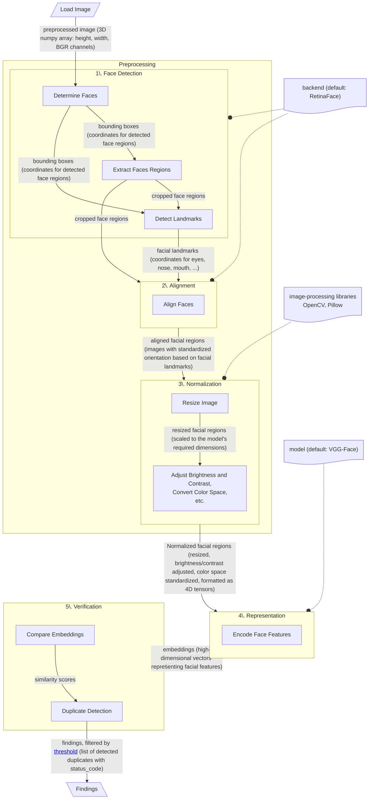

---
tags:
  - Deduplication
---

# **Image Processing and Duplicate Detection**

### How Face Recognition Works.

The process of face recognition can be divided into a structured pipeline consisting of five key stages. Each step plays a vital role in transforming raw images into actionable insights, such as identifying individuals or detecting duplicates in a dataset.

At the core of this process are Convolutional Neural Networks (CNNs), which excel at extracting hierarchical features from images, from edges to complex patterns. Their effectiveness makes them fundamental for tasks like face detection and recognition.([Read More](https://www.researchgate.net/publication/379189553_A_review_of_convolutional_neural_networks_in_computer_vision))

Central to this pipeline is [DeepFace](https://github.com/serengil/deepface), a versatile Python library for facial recognition. Supporting multiple pre-trained models and detection backends, it simplifies face verification and duplicate detection with static images.

---

### Steps in the Workflow.

??? abstract "Face Detection"
    #### _**Face Detection**_

    The first step involves identifying and locating faces within an image. [DeepFace](https://github.com/serengil/deepface) leverages detectors such as *OpenCV*, *RetinaFace*, *MTCNN*, and others. By default, the service [uses](config.md#detector_backend) **RetinaFace** that is a state-of-the-art single-stage face detector that performs pixel-wise face localization by jointly predicting face scores, bounding boxes, and five facial landmarks. It achieves high accuracy even under challenging conditions, such as varying poses and occlusions.([Read More](https://arxiv.org/abs/1905.00641))

    This process includes:

    - Determining the location of faces (bounding boxes).
    - Extracting facial regions for further processing.
    - Anti-Spoofing (optional). [DeepFace](https://github.com/serengil/deepface) supports anti-spoofing to detect fraudulent attempts, such as using photos or masks instead of real faces. It uses models like **MiniFASNet** to assess the authenticity of detected faces. However, anti-spoofing is less relevant for static photos, as dynamic cues like blinking or texture variations are unavailable. This step is optional and disabled by default, requiring explicit configuration.

    Accurate face detection is crucial, as errors at this stage can propagate through the pipeline, affecting overall performance.

---

??? abstract "Alignment"

    #### _**Alignment**_
    Alignment eliminates facial tilts and rotations, standardizing the orientation of the detected face. This process relies on facial landmarks (eyes, nose, mouth) to ensure consistent positioning. By default, the service [uses](config.md#detector_backend) **RetinaFace** that provides accurate localization of these landmarks, facilitating effective alignment.([Read More](https://arxiv.org/abs/1905.00641))

    Benefits of alignment:

    - Improved accuracy in face recognition.
    - Reduced sensitivity to variations in camera angles.

---

??? abstract "Normalization"

    #### _**Normalization**_
    Normalization prepares the face for processing by:
    - Resizing the image to a standard size.
    - Adjusting brightness and contrast.
    - Converting the color space (e.g., grayscale conversion).

    These steps ensure the data is more suitable for deep learning models.

    [DeepFace](https://github.com/serengil/deepface) handles normalization internally using standard image preprocessing techniques provided by popular image-processing libraries such as [OpenCV](https://opencv.org/) and [Pillow](https://pillow.readthedocs.io/en/stable/). These steps ensure consistency in the input data, making it suitable for processing by deep learning models like **VGG-Face** or others. The resizing operation ensures compatibility with the input dimensions required by the selected model (e.g., 224x224 pixels for VGG-Face).

---

??? abstract "Representation"

    #### _**Representation**_
    At this stage, unique facial features are extracted and encoded into numerical vector representations, commonly referred to as **embeddings**. These embeddings are high-dimensional mathematical representations that capture the distinctive characteristics of a face, such as the relative positions of facial landmarks, texture, and shape. By transforming faces into embeddings, systems can efficiently compare, verify, and search for faces within datasets, enabling accurate recognition and matching.

    [DeepFace](https://github.com/serengil/deepface) supports several pre-trained models for this purpose, including vgg-face, facenet, facenet512, openface, deepid, arcface, dlib, sface, and ghostfacenet.

    By default, the service [uses](config.md#model_name) **VGG-Face**, a model developed by the Visual Geometry Group at the University of Oxford. ([Read More](https://www.robots.ox.ac.uk/~vgg/software/vgg_face/))

    The vgg-face model is based on the VGG-Very-Deep-16 CNN architecture and was trained on a dataset of 2.6 million images of 2,622 identities. ([Read More](https://arxiv.org/abs/1503.03832))

---

??? abstract "Verification and Duplicate Detection"

    #### _**Verification and Duplicate Detection**_
    In the final stage of the face recognition pipeline, the system performs two critical tasks:

    - **Verification:** This process involves comparing two facial embeddings to ascertain whether they represent the same individual. [DeepFace](https://github.com/serengil/deepface) utilizes similarity metrics such as cosine similarity, Euclidean distance, and L2-normalized Euclidean distance for this purpose. By default, the library employs **cosine similarity** as the distance metric due to its efficiency and effectiveness in comparing high-dimensional vectors. Cosine similarity measures the angle between vectors, focusing on their relative orientation rather than magnitude, which makes it particularly suitable for facial recognition tasks where the relative differences between features are more critical than their absolute values.([Read More](https://en.wikipedia.org/wiki/Cosine_similarity))

    - **Duplicate Detection:** This task entails scanning a database of facial embeddings to identify multiple entries corresponding to the same person. By measuring the similarity between embeddings and applying a predefined **similarity threshold**, the system determines whether two embeddings represent the same individual. This threshold ensures a balance between detecting duplicates and minimizing false positives, allowing the system to accurately consolidate duplicate records while maintaining the integrity and accuracy of the dataset. The similarity threshold is [adjustable](config.md#face_distance_threshold), enabling fine-tuning for specific use cases, such as stricter matching criteria or broader detection in diverse datasets.

---

## **General Process Diagram.**

