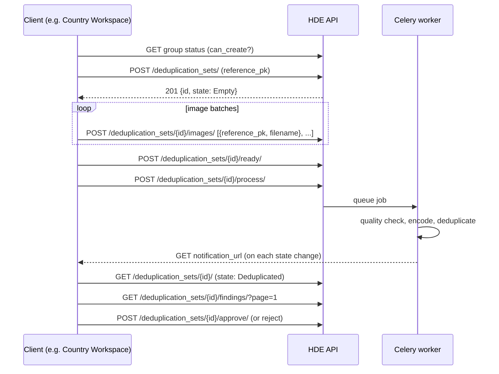

# End-to-End Workflow

A complete deduplication run, from creating the set to approving the results. Examples use [httpie](https://httpie.io/); `$BASE` is the server URL and the `Authorization` header is omitted for brevity.



## 0. (Optional) Check the group status

Only one set can be active per group. If a previous run is still in flight or awaiting approval, creating a new set will fail with 409 — check first:

```console
$ http GET $BASE/deduplication_set_groups/PROGRAM-2024-001/status/
{
    "can_create": true
}
```

## 1. Create a deduplication set

```console
$ http POST $BASE/deduplication_sets/ \
    reference_pk="PROGRAM-2024-001" \
    name="Intake batch March" \
    notification_url="https://my-system.example.org/hde-callback?set=..." \
    notify:=true
```

```json
{
    "id": "3fa85f64-5717-4562-b3fc-2c963f66afa6",
    "reference_pk": "PROGRAM-2024-001",
    "name": "Intake batch March",
    "notification_url": "https://my-system.example.org/hde-callback?set=...",
    "notify": true,
    "state": "Empty"
}
```

- `reference_pk` (required) — your group identifier. The group is created automatically on first use; subsequent sets with the same value join the same group.
- `notification_url` / `notify` (optional) — see [Notifications](notifications.md).
- The returned `id` is what you use in all subsequent calls.

Returns **409** if the group already has an active set.

## 2. Register images

Send batches of `{reference_pk, filename}` pairs. `reference_pk` is your identifier for the individual; `filename` is the image as a **base64 data URL** (`data:<mimetype>;base64,<payload>`). The engine decodes the payload, stores the file on disk (via the `images` storage backend), and keeps the resulting path on the encoding record.

```console
$ http POST $BASE/deduplication_sets/3fa85f64-.../images/ \
    Content-Type:application/json <<< '[
        {"reference_pk": "IND-0001", "filename": "data:image/jpeg;base64,/9j/4AAQ..."},
        {"reference_pk": "IND-0002", "filename": "data:image/png;base64,iVBORw0K..."}
    ]'
```

- Batches can be sent **multiple times and in parallel**; the set moves to `Uploading in progress` after the first one.
- Registration is **idempotent per `reference_pk`**: re-sending the same `reference_pk` replaces the previously stored image file.
- The file extension is derived from the MIME type in the data URL (e.g. `image/jpeg` → `.jpg`).
- To discard everything and start over: `DELETE /deduplication_sets/{id}/images/clear/` (resets the set to `Empty`).

Returns **409** once the set has left the `Empty`/`Uploading in progress` states.

## 3. Mark the set ready

When all batches have been sent:

```console
$ http POST $BASE/deduplication_sets/3fa85f64-.../ready/
```

The set moves to `Ready`. Returns **409** unless the set is in `Uploading in progress`.

## 4. Start processing

```console
$ http POST $BASE/deduplication_sets/3fa85f64-.../process/
{
    "message": "started"
}
```

- Allowed in `Ready`, `Encoded`, `Encoding failed`, and `Deduplication failed` states — so the same endpoint is also the **retry** mechanism after failures and the **re-run** mechanism after settings changes.
- Pass `?encode_only=true` to stop after the encoding stage (the set ends in `Encoded` instead of `Deduplicated`). Useful for pre-computing embeddings before deciding on thresholds.
- Returns **409** if the set is in a non-processable state or another job is already running in the group.

Processing is asynchronous. Track progress by [polling the set or receiving webhook notifications](notifications.md):

```console
$ http GET $BASE/deduplication_sets/3fa85f64-.../
{
    "id": "3fa85f64-5717-4562-b3fc-2c963f66afa6",
    "reference_pk": "PROGRAM-2024-001",
    "name": "Intake batch March",
    "state": "Deduplicated",
    "findings_count": 12,
    "created_at": "2026-07-13T10:00:00Z",
    "updated_at": "2026-07-13T10:05:42Z"
}
```

## 5. Read the findings

Available once the set is in `Deduplicated` state (the endpoint returns an empty list in other states):

```console
$ http GET "$BASE/deduplication_sets/3fa85f64-.../findings/?page=1&page_size=1000"
```

See [Findings and statuses](findings-and-statuses.md) for the response format, pagination, and filtering.

## 6. Approve or reject

Both are final and only allowed in `Deduplicated` state:

```console
$ http POST $BASE/deduplication_sets/3fa85f64-.../approve/
$ http POST $BASE/deduplication_sets/3fa85f64-.../reject/
```

- **Approve** accepts the results. The set's embeddings become permanent reference data: images in future sets of this group will also be compared against them. Approved sets no longer appear in `GET /deduplication_sets/`.
- **Reject** discards the results. The group is free for a new set.

!!! warning "Approval affects future runs"
    Approving is more than bookkeeping — every future deduplication in the group compares against all approved sets. Also, once a group contains an approved set, its [settings can no longer be changed](configuration.md#when-changes-are-refused).

## Deleting a set

`DELETE /deduplication_sets/{id}/` removes the set with all its images, embeddings, and findings. Use it to abandon a run that hasn't been approved.
